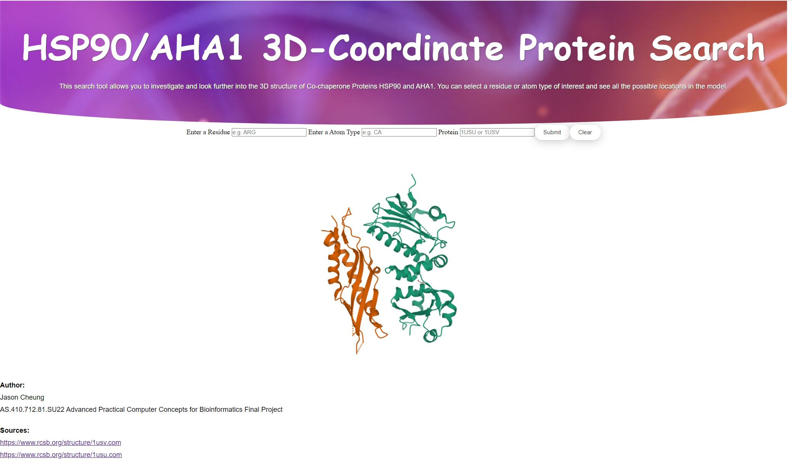

# Hsp90/Aha1 3D-Coordinate Protein Search

**Jason Cheung Final Project**

**AS.410.712.81.SU22 Advanced Practical Computer Concepts for Bioinformatics**

**Apcc-bfx Final Project doing a small scale 3D-Coordinate Protein Search Tool for Protein Structure Complex 1USU and 1USV**

**http://bfx3.aap.jhu.edu/jcheung9/final/search.html**

**Source code Can be obtained here:
**

## Getting Started

### Code and Resources Used

**Python Version:** 3.7.3

**Packages and Modules:** pandas, mysql, argparse, jinja2, cgi

**RSCB PDB Tool:** https://rscb.org

**Understanding PDB Data Article:** https://pdb101.rcsb.org/learn/guide-to-understanding-pdb-data/introduction

### Instructions

You should type in which protein complex you would like to analyze (1USU or 1USV) under the protein search box. Note that the website will require you to input a protein complex while the other search parameters are optional.

You can choose and enter either a atom type or residue of interest to see all the possible locations in the model:
* [amino acid residues](https://www.sigmaaldrich.com/US/en/technical-documents/technical-article/protein-biology/protein-structural-analysis/amino-acid-reference-chart) using their 3 letter abbreviation

* [atom id](https://ptable.com/)

